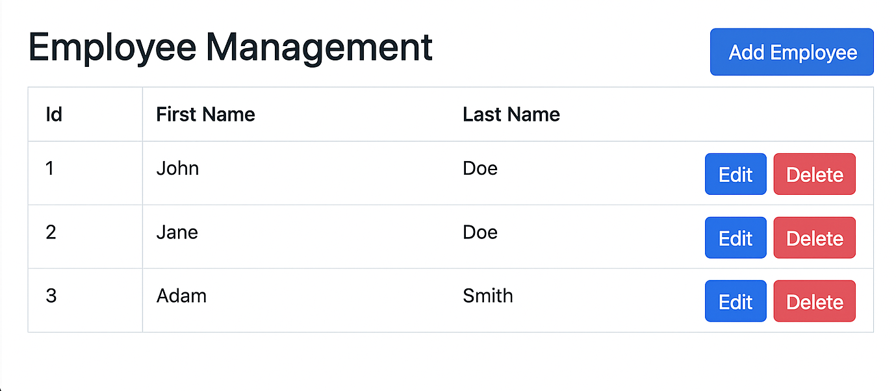

# ReactJS-Spring-Boot-CRUD-Full-Stack-App

A full-stack CRUD (Create, Read, Update, Delete) application built using **ReactJS** for the frontend and **Spring Boot** for the backend. This project demonstrates how to create a responsive, user-friendly interface for managing employee records and performing CRUD operations with a MySQL database.

## Demo Output

Below is a screenshot showing the application output:

## Project Overview

This project is a complete example of a full-stack application using ReactJS and Spring Boot. Users can perform CRUD operations on employee data via a modern web interface. The backend exposes REST APIs using Spring Boot, while the frontend consumes these APIs using Axios.

---

## Features

- Add new employee records.
- View a list of all employees.
- Update existing employee information.
- Delete employee records.
- Responsive UI built with ReactJS.
- Persistent storage using MySQL.

---

## Technologies Used

- **Frontend:** ReactJS, React Router, Axios, HTML, CSS, JavaScript
- **Backend:** Spring Boot, Spring Web, Spring Data JPA
- **Database:** MySQL
- **Build Tools:** Maven, Node.js, npm

